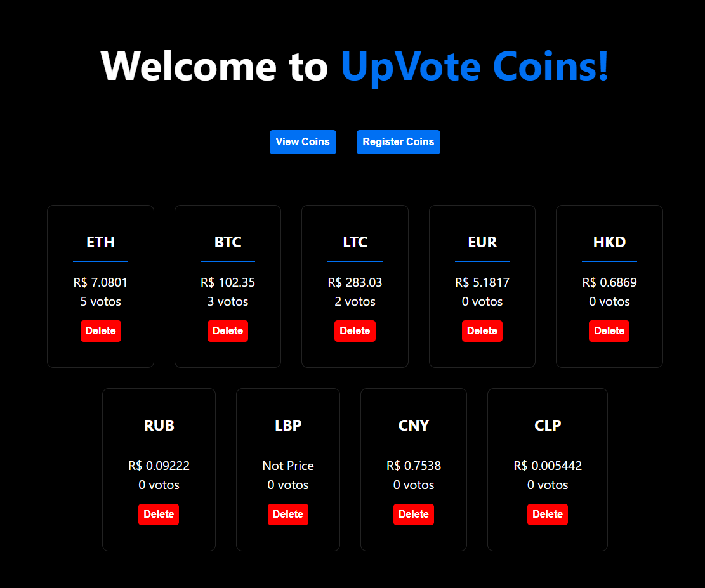
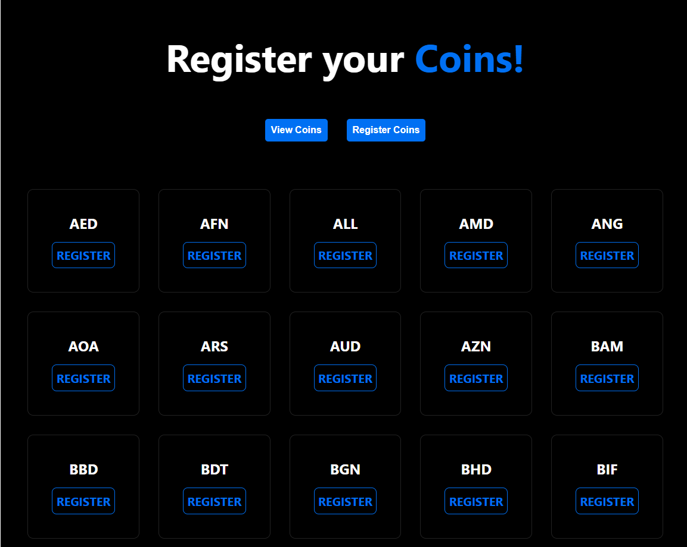

# UpVote - Front
## This page show some coins to registered, voteand show the current price.

<div align="center">
  
</div>

<h3 align="center"> 
	  UPVote 💲 Working...  👨‍💻
</h3>

<h4 align="center"> 
	  https://up-vote-coins-56gxvu7k8-caiolucolaco.vercel.app/
</h4>

<h3 align="center">
 <a href="#features">Features</a> •
 <a href="#-tecnologias">Tecnologias</a> • 
 <a href="#Pré-requisitos">Pré-requisitos</a> • 
 <a href="#-Pages">Pages</a> • 
 <a href="#autor">Autor</a>
</h3>

### Features
---

- [x] Servir Página de exibição das moedas
- [x] Servir página de registos
- [x] Recuperar dados da Api Golang
- [x] Recuperar dados da API Gratuita de Moedas


### 🛠 Tecnologias
---


As seguintes ferramentas foram usadas na construção do projeto:

- [React](https://go.dev/doc/)
- [Next](https://pt-br.reactjs.org/docs/getting-started.html)


### Pré-requisitos
---

Antes de começar, você vai precisar ter instalado em sua máquina as seguintes ferramentas:
[Git](https://git-scm.com), [Go](https://go.dev/doc/). 
Além disto é bom ter um editor para trabalhar com o código como [VSCode](https://code.visualstudio.com/)

### 🎲 Rodando o Back End (servidor)

```bash
# Clone este repositório
$ git clone <https://github.com/CaioLuColaco/upVote_Coins.git>

# Acesse a pasta do projeto no terminal/cmd
$ cd upVote_Coins

# Instale as dependências
$ pnpm i

# Execute a aplicação em modo de desenvolvimento
$ pnpm dev

# O servidor inciará na porta:2005 - acesse <http://localhost:3000>

```

### 📒 Pages
---





### Autor
---

<a href="https://github.com/CaioLuColaco">
 
 <br />
 <sub><b>Caio Lucena Colaço</b></sub></a> <a href="https://www.instagram.com/caio_colaco/" title="Contato">👽</a>


Feito por Caio Lucena Colaço 👋🏽 Entre em contato!

[](https://www.linkedin.com/in/caiolucenacolaco/) 
[](mailto:caio.lcolaco@gmail.com)

